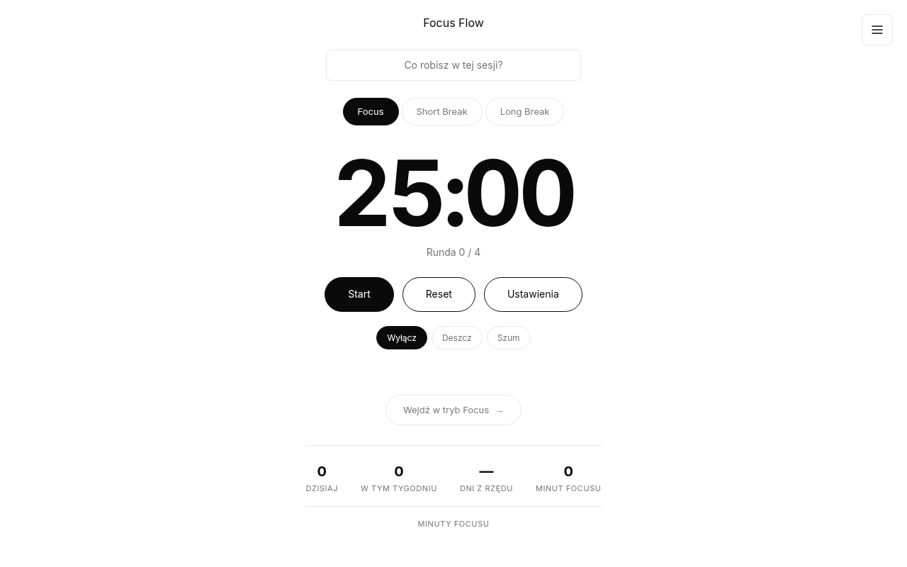

# Focus Flow

> Minimalistyczny minutnik Pomodoro z trybem focus, statystykami, ambientowymi dźwiękami i poradami do efektywnej nauki.

## Funkcje

- **Timer Pomodoro** – 3 tryby: Focus, Short Break, Long Break
- **Customizable** – ustawiasz czasy i liczbę rund do long break
- **Tryb Focus** – pełny ekran z samym timerem, bez rozpraszaczy
- **Dźwięki otoczenia** – deszcz (3 warstwy + LFO) i szum (pink noise) przez Web Audio API
- **Lista zadań** – wpisz co robisz w tej sesji, odhacz po zakończeniu
- **Statystyki** – dzisiaj, tydzień, streak, minuty focusu
- **Wykres tygodnia** – słupki minut focusu z ostatnich 7 dni
- **Wskazówki** – 5 kategorii (Nauka, Przerwa, Sen, Jedzenie, Produktywność), rozwijane sekcje, PL/EN
- **Auto-start** – opcjonalne automatyczne rozpoczynanie kolejnej rundy
- **Motyw jasny/ciemny** – przełącznik w sidebarze, zapis preferencji
- **i18n PL/EN** – cały interfejs w dwóch językach
- **Notification API** – powiadomienia po zakończeniu rundy
- **Skróty klawiszowe** – spacja (start/stop), `r` (reset), `f` (tryb focus)
- **Dark/light mode** – ręczny przełącznik i system auto-detect
- Wszystko zapisane w localStorage

## Tech Stack

- HTML5
- CSS3 (zmienne, prefers-color-scheme, clamp, flexbox, grid)
- Vanilla JavaScript (ES6+)
- Web Audio API
- localStorage API
- Notification API

## Uruchomienie

Otwórz `index.html` w przeglądarce lub wrzuć na Vercel/Netlify.

## Live Demo

[https://focus-flow-self-ten.vercel.app/](https://focus-flow-self-ten.vercel.app/)

## Autor

Mateusz Szostak – [w3ziqv](https://github.com/w3ziqv)
