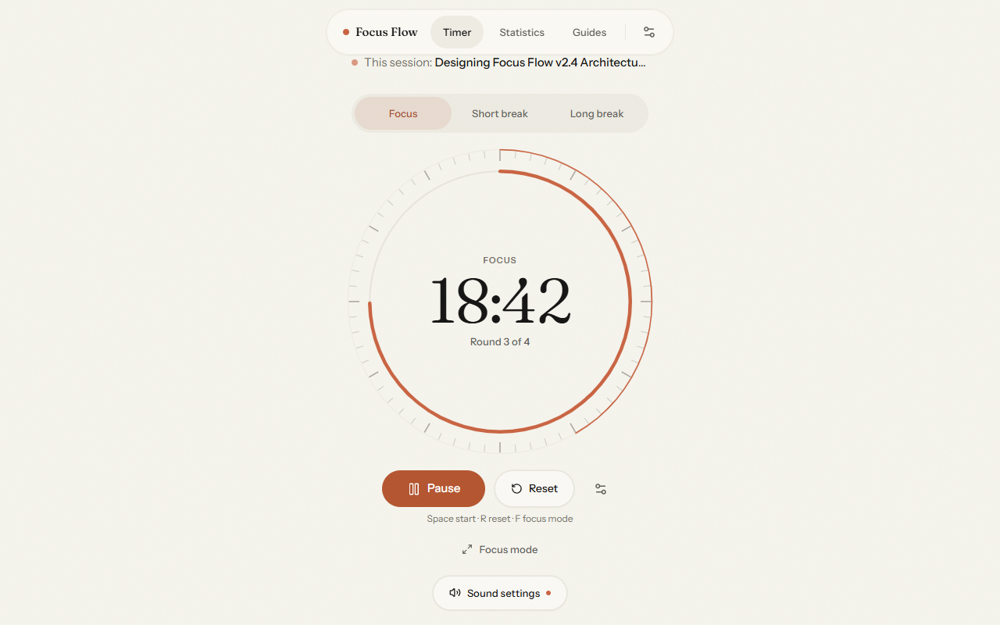
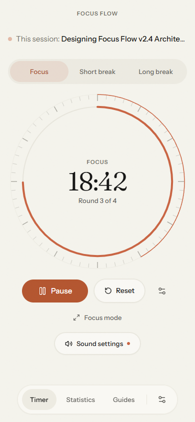

# Focus Flow

Minimalistyczny minutnik Pomodoro z trybem Focus, dźwiękami otoczenia, statystykami i poradami do efektywnej nauki. Interfejs w języku polskim i angielskim.

## Zrzuty ekranu

| Desktop | Mobile |
| --- | --- |
|  |  |

## Funkcje

- Timer Pomodoro z trzema trybami: Focus, Short Break, Long Break
- Konfigurowalne czasy, liczba rund i auto-start kolejnej rundy
- Tryb Focus — pełny ekran z samym timerem, bez rozpraszaczy
- Dźwięki otoczenia: deszcz i szum (Web Audio API) oraz upload własnych plików audio
- Lista zadań na bieżącą sesję
- Statystyki: dziś, w tym tygodniu, streak, łączne minuty focusu, wykres z 7 dni
- Porady do nauki w pięciu kategoriach
- Motyw jasny/ciemny, powiadomienia, skróty klawiszowe
- Interfejs PL/EN, stan zapisywany w localStorage
- PWA: instalowalna, działa offline

## Tech Stack

- HTML, CSS (zmienne, grid, flexbox)
- Vanilla JavaScript (ES modules)
- Web Audio API, Notification API, localStorage
- Service Worker

## Uruchomienie

Projekt jest statyczny — otwórz `index.html` w przeglądarce albo wdróż na dowolny host (Vercel, Netlify). Nie wymaga builda ani zależności.

Demo: <https://focus-flow-self-ten.vercel.app/>

## Projekt

```
src/
  main.js      Wejście i obsługa zdarzeń
  timer.js     Logika timera i trybów
  audio.js     Dźwięki otoczenia i odtwarzanie
  stats.js     Statystyki i wykres
  tips.js      Porady do nauki
  i18n.js      Tłumaczenia (PL/EN)
  state.js     Stan i localStorage
  ui.js        Przełączanie widoków i motywu
  dom.js       Referencje do elementów DOM
  sw-register.js Rejestracja service workera
```

## Autor

Mateusz Szostak — [w3ziqv](https://github.com/w3ziqv)

## Licencja

MIT
